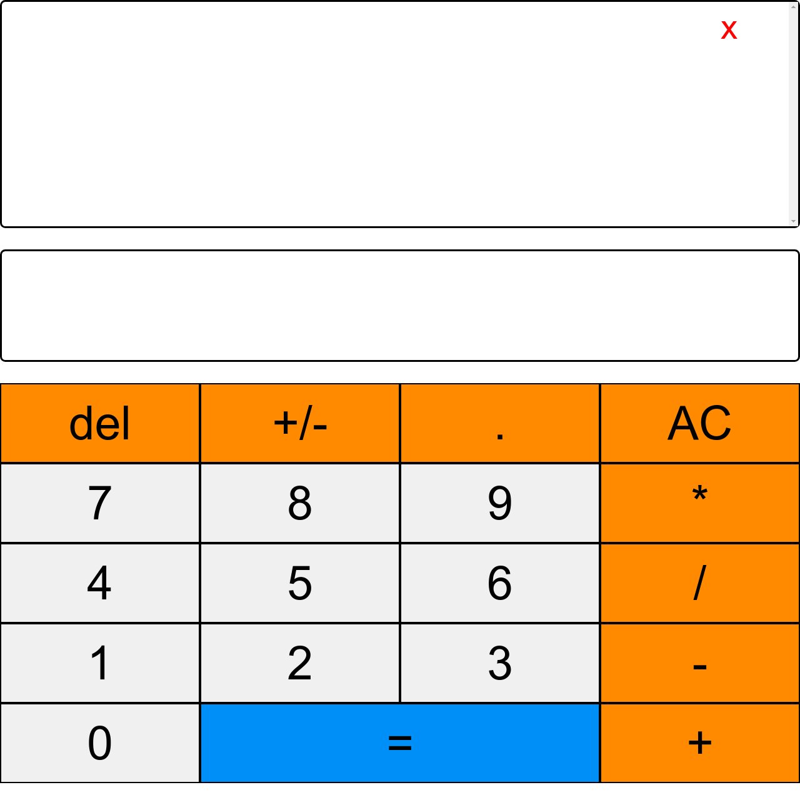

# JavaScript Calculator

> JavaScript Project Written for The Odin Project

<div align='center'>
  
</div><br>

## Demo

[View the Live Demo](https://andrewbaldwin44.github.io/JavaScript_Calculator/)

## Features

1. A fully responsive design. Enjoy the app on any device!
2. Live history of calculations that persist in local storage
3. Keyboard support

## Deploy the project

__Clone the repo to your local machine using the terminal__:
```
$ git clone git@github.com:andrewbaldwin44/JavaScript_Calculator.git
```

*Then Open the `index.html` Project File in Your Browser*

## Technologies Used:

- JavaScript
- HTML
- CSS

## Author

👤 **Andrew Baldwin**

- Github: [@andrewbaldwin44](https://github.com/andrewbaldwin44)
